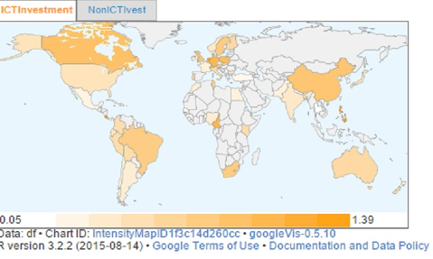

#**What effect does ICT investment and non-ICT investments have on economic growth in Developed, Emerging and Developing Countries**#
  
## Global ICT investment 2010

The information revolution and the extraordinary increase in the spreading of knowledge have given rise to a new era of knowledge and information, affecting directly economic, social, cultural and political activities of all regions of the world (Ogunsola, 2005).This information revolution is related to the growth of ICT Capital within the global economic. The intensity map displayed above provides a brief outline of ICT capital growth for the year 2010.

In the map we see a difference in ICT capital investment among developed, emerging and developing. But in order to understand the impact of ICT capital further analysis on the topic is required.

We tried to understand the growth of ICT capital investment and how it impacts economic growth by applying some analytical tools and creating visual graphics.
The scatter plot displayed below provides a time series ICT capital growth from the year of 1995 to 2010. We can observe that there is steady growth in ICT capital among emerging and developing economies.The category 1, 2 and 3 represents developed,  emerging and developing countries respectively.
Some particular emerging countries have high ICT system since 1995 for example Malaysia and with regards to developing countries Sri Lanka shows positive trends in ICT capital growth.   

# Driving the relationship between economic growth and ICT investment 

GDP growth percentage can be a valid indicator for giving an overview of economic development in a country.  The bar graph created below provides us with the GDP growth data for 1995 among developed, emerging and developing economies. The middle section of the graph consist of emerging countries and we can observe that GDP growth is similar to developing countries; which are displayed on the right side of the graphs. 

But when we compare the GDP growth graph of 1995 with 2010; we see a substantial increase in GDP growth especially among emerging countries and developing countries.  

There could be many driving factors like- health, education, labour force etc. which causes economic growth. Some authors are of the opinion that Information Communication Technology can also play role of economic development of the country.

_Advancements in ICT can be a tool for developing and emerging economies to leap frog traditional methods of increased productivity resulting in ICT related positive spill overs (Steinmueller, 2010)_

On the contrary some authors has oppositive view of impact ICT has over economic growth 

_Aside from its reliance on technology, ICT also requires an absorptive capacity in terms of labor and technical skills, to fully benefit from the investments in ICT infrastructure (Jorgenson and Stiroh 1995)_

This lack of absorptive capacity and limited ICT skills are characteristics of certain developing countries.In order to drive the relation between ICT capital growth and economic growth it is important to analyse ICT investment trends over time period.  

### Comparing ICT and Non-ICT investment for the year 1995

In the year 1995 Non- ICT investment is higher than ICT investment in developing and emerging economies.We can interpret from the data that in year 1995 emerging and developing countries did not possess ICT absorptive characteristics and technical skills therefore Non-ICT investment played a major role in economic growth.On the contrary in the developed countries ICT investment and Non-ICT investment showed similar trends in growth.

### Comparing ICT and Non-ICT investment for the year 2010

When Non-ICT investment and ICT investment for the year 2010 are analysed; we observe that the difference in ICT investment and Non ICT investment is reduced in emerging countries. In developing countries Non-ICT investment is still higher when compared to ICT investment. Observing the data we say that over the period of time emerging countries developed some ICT skills and capacity which contributed in economic growth. Whereas in developing countries Non-ICT still contributes higher share in economic growth as compared to ICT investment. Therefore developing countries lack the absorptive capacity of ICT growth which has been witnessed in other parts of the world.

### Country with highest ICT service capital in year 1995

Globally Malaysia had the highest ICT service growth for the year of 1995; Malaysia has been categorized as emerging country. After Malaysia we observed New Zealand, Canada and Slovenia had high ICT investment.

### Country with highest ICT service capital in year 2010

In year 2010 we observed that ICT service capital growth increased in emerging economies but in certain developed countries we also observed a little increase in ICT service. The highest ICT investment for the year 2010 was observed in Netherlands.

### Global impact of Non-ICT capital in developing countries year 2010

As we have observed in the above diagrams that Non-ICT investment is higher developing countries; the above intensity map of the Non-ICT investment shows that in the year 2010 certain countries had higher Non-ICT investment even within developing countries.

## 10. Limitations of the study
One of the key limitations that our study presents is the lack of available data explaining the impact of ICT in developing and emerging markets (as claimed in the literature review). The limited number of observations and of years covered that our analysis presents might create some general measurement issues, impeding us to make any generalizations, undermining the external validity of our test. The selected sample of countries being analyzed does not allow for proper randomization and thus we might be encountering some sample selection bias effect, with the sample obtained being not representative of the population being analyzed. Moreover, the limitation of our study on the mere effect of ICT contribution and non-ICT contribution to explain economic growth does not fully constitute an answer to what is attracting ICT investments. Other factors such as social development indicators (government effectiveness, political stability, unemployment rate) educational indicators (enrolment rates in primary, secondary and tertiary education), additional economic indicators (current account balance, real interest rates, trade balance, total investment, government revenues etc.), demographic indicators and technological indicators, should have been taken into account to make the sample of the study more representative. 

