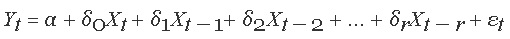
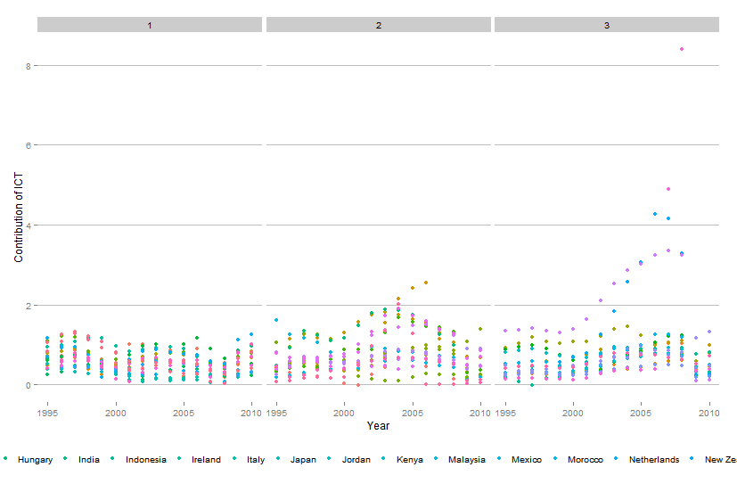
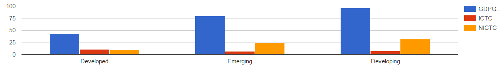
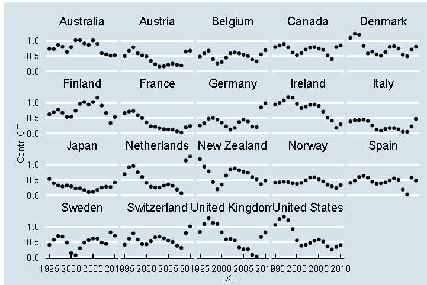
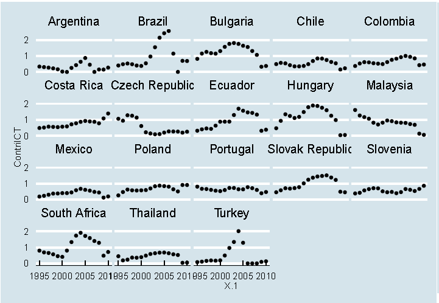
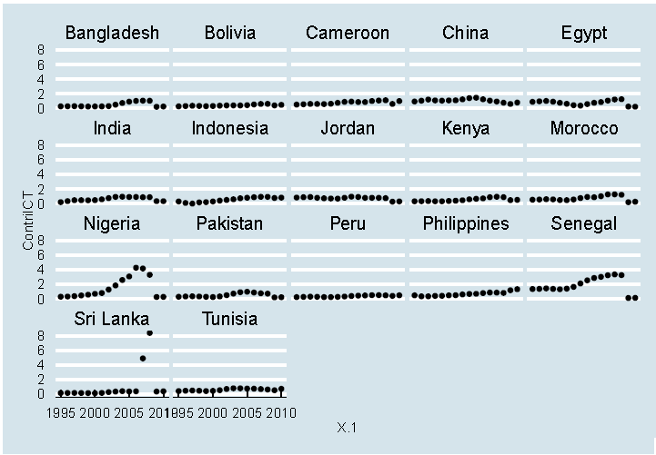

# Impact of ICT on GDP growth in Developed, Developing and Emerging Countries

# Abstract 

This paper aims at analyzing the validity of the relationship between Information and Communication Technology (ICT) and economic development, expressed in terms of GDP growth. The study provides a cross-country view on the issue upon assessing the impact of ICT on economic growth for 54 countries from the developed, emerging and developing world. Our results show that even though the impact of ICT capital stock per capita is significant in the developed and emerging economies, it cannot be used to make generalizations for the developing countries.

# Introduction 

The information revolution and the extraordinary increase in the spreading of knowledge have given rise to a new era of knowledge and information, affecting directly economic, social, cultural and political activities of all regions of the world[@ogunsola2005information] 

For years, Information and Communication Technologies (ICT) has been identified as a key driver for improving living standards. These higher living standards often correlate with productivity growth[@timmer2010economic]and thus economic growth.

Researchers and policy makers have been highlighting the incredible benefits brought about by Information Technology, integrating modern economies and inevitably affecting economic and industrial growth. Overall, incredibly high expectations have been set on the advancements in ICT, as being a tool for developing and emerging economies to leap frog traditional methods of increased productivity resulting in ICT related positive spillovers (Steinmueller, 2010) and reducing poverty upon increasing productivity and determining economic growth[@world2012world]

However, it is known from time immemorial that everything in life is like the two sides of a coin, with a positive and negative aspect. As a matter of fact, only people who have access to ICT will benefit from it whereas those who do not, will not. Especially for those countries in which ICT investments are scarce, the risk of being marginalized or bypassed becomes even higher. Many scholars and researchers nowadays have been focusing on the topic of digital divide and increased gross inequalities between nations determined by globalized investments in ICT. Aside from its reliance on technology, ICT also requires an absorptive capacity in terms of labor and technical skills, to fully benefit from the investments in ICT infrastructure[@jorgenson1995computers]

Moreover given the limitation of studies of the effective benefits brought about by ICT in developing and emerging markets, it is hard to make generalizations on the actual impact that the mere investment in ICT infrastructure is causing[@pena2007information]

The largest effect of increased availability of ICT technology is probably the facility by which members of societies have access to information. In modern times, in a world of increasing gross inequalities between nations, contemporary discourses have been trying to identify forces that could improve countries socio -economic conditions and reduce inequalities between developed and developing countries. However, current debates are rather centered on the topic of digital divide, and on how the globalization of markets.

# Literature Review

It comes with no doubts that the investment in ICT has had a significant impact on many countries worldwide, affecting the way people learn, work and exchange information. Ever since the advent of computers, government policy advisors and international developing agencies have pointed to the opportunities that technologies open to innovation(Avgerou, 2009).

For years ICT was also identified as one of the key tools to foster economic development, with a majority of studies and panel regressions confirming the positive relationship between ICT Capita and GDP Growth[@cardona2013ict]."This evolving global communication fabric is intelligent, adaptive and highly innovative and its impact can be felt at both the micro and macro economics levels"(World Economic Forum, 2009). 

Several growth accounting studies revealed a significant contribution of ICT on economic performance especially after the year 1990 in developed economies. This effect can be related to the productivity miracle occurring as soon as quality adjusted and the costs for ICT tools started falling. Closer examination on the contribution of ICT to output and productivity growth was initiated by [@oliner2000resurgence] and [@jorgenson1995computers].Besides the follow-up studies by Jorgenson and Stiroh (2000), and Oliner and Sichel (2001, 2002) for the U.S. economy, the notable studies on individual countries include [@oulton2002ict] for the United Kingdom,[@jalava2001economic] for Finland, [@van2001does] and [@khan2002contribution] for Canada,[@gordon2002new] for Germany,, and [@cette2000diffusion]for France.The significant studies for a group of countries include [@colecchia2002ict], Colecchia and Schreyer (2001), Ark et al (2002), and Daveri (2002) for most EU economies; and Jorgenson (2003) for the G7 economies.

United Nations ICT Taskforce has identified ICT as key tool to enable economic growth in developing countries offering these the unique opportunity to leapfrog certain stages of development by the use of technologies that undergo the traditional stages of progress to the information society (Force, U.I.T., 2003). Moreover, United Nations ICT Taskforce has identified ICT as key tool to enable economic growth in developing countries offering these the unique opportunity to leapfrog certain stages of development by the use of technologies that undergo the traditional stages of progress to the information society (Force, U.I.T., 2003). 
However, as the listing shows, most of the studies are centered on developed economies, with a scarcity of studies on the emerging and developing countries. This stresses the questionable validity of the effective impact that ICT has on economic development. As a matter of facts, more recently the link between ICT and development has been articulated in the alarming terms of the " digital divide"(Avgerou, 2009).

Many researchers and scholars have argued that globalization has instead determined the possible widening of the gap between the rich and the poor nations, and caused the emerging of the concept of "digital slavery"(Ogunsola, 2005)
Moreover, lacking absorptive capacities such as appropriate levels of human capital or insufficient funding for conducting research and development are all valid factors to consider when studying the effect of ICT in these different country classifications. 

# Data 
We analyze the impact of ICT on GDP growth as well as the effect of Non ICT on GDP growth, (i.e. manufacturing and infrastructure). The primary data source for the study was complied from Conference Board Total Economy Database[@growthdevelopment]. Total Economy Database (TED), an open source database used for the economic and business knowledge collected by the organization " The Conference Board" and the World Bank Development Indicator ( WDI), mainly used for the inclusion of observations for the control variables, namely "Export percentage of GDP" and "Population annual percentage growth". 
The TED dataset contains annual data for GDP, ICT and non ICT Capital Service and labor services for 123 countries with a timeframe ranging from 1990 to 2013. Due to missing variables in output and capital input, the time series for this study is limited to the years 1995 to 2010. Moreover, the number of countries has been reduced to 56 (19 Developed, 19 Emerging and 18 Developing Countries, randomly selected) with a total of 864 observations.

#  Definition of key concepts and variables

## Developed Countries: 
While there is no one, set definition we classify developed countries as those with a relatively high level of economic growth and security. Specifically we look at the GDP per capita levels and GNI. When above $ 23000 in 2013, we consider a country developed.

## Developing Countries:
We define developing countries as those lacking in terms of its economy, infrastructure and industrial base. We associate low standard of livings and we group under this category all those countries with a GDP/GNI ratio lower than $6500 in 2013.

## Emerging Markets
Also for emerging markets, there has not been a commonly accepted definition, however we define them as those nations experiencing rapid growth, industrialization and socio economic development. There are 3 aspects underlying the definition of emerging markets: 1) the absolute level of economic development, indicated by the average GDP per capita; 2) the relative pace of economic development, indicated by the GDP growth rate; 3) the system of market governance and the extent and stability of free market systems (Arnold, D. & Quelch, A., 1998) We only focus on point 2, studying the effect that ICT investments have on annual GDP percentage growth.

## GDP
Defined as an aggregate measure of production. It is the sum of the gross values added of all resident institutional units engaged in production (plus any taxes and minus any subsidies on products not included in the value of their outputs). The sum of the final uses of goods and services (all uses except intermediate consumption) is measured in purchasers' prices less the value of imports of goods and services, or the sum of primary incomes distributed by resident producer units. Based on the levels of GDP, we have classified countries accordingly

i)Developed
Countries with a GDP per capita in terms of Purchasing Power Parity higher than $23.000 with adjusted value of year 1995 to 2013 US dollars.
ii)Emerging 
Countries with a GDP per capita in terms of Purchasing Power Parity ranging between $23.000 and $6.500 with adjusted value of year 1995 to 2013 US dollars.
iii)Developing
Countries with a GDP per capita in terms of Purchasing Power Parity lower than $6.5000 with adjusted value of year 1995 to 2013 US dollars.

## GDP Growth 
The sum of the final uses of goods and services are measured in Purchasing Power Parity (PPP) expressed in 2013 U.S dollars. 

## Economic Growth 
An increased capacity of an economy to produce goods and services in one period of time compared to a prior time period. It is measured in terms of Gross Domestic Product. Comparison of levels of economic growth between countries is based on levels of GDP per capita. Economic growth is usually associated with technological changes and can thus best reflect the impact of ICT. Past economic growth is key to the material well being of people today. 

## ICT
The acronym ICT stands for Information Communication Technology. We define ICT as the acquisition of equipment and computer software that provide access to information through telecommunication. For the purpose of this study we will only look at 2 communication technologies, the Internet and cell phones as we assume these to be key drivers in the boosting economic growth.

## ICT Capital Services Growth 
Defined as the change in the flow of productive services provided by ICT assets. We focus on three types of ICT assets namely computer hardware and equipment, telecommunication equipment, and computer software and services. The underlying capital stock series are calculated from the investment data using the perpetual inventory method. The aggregation of the growth in capital services over the different asset types is calculated using the user cost approach.

## Non ICT Capital Service Growth 
Refers to the change in the flow of productive services provided by non-ICT assets. Three types of non-ICT assets are included-transport equipment; plant, machinery, and other non-ICT equipment; and construction, building and other structures. The underlying capital stock series are calculated from the investment data using the perpetual inventory method. The aggregation of the growth in capital services over the different asset types is calculated using the user cost approach.	

## Export percentage of GDP
The export of goods and services representing the value of all goods and other market services provided to the rest of the world. They include the value of merchandise, freight, insurance, transport, travel, royalties, license fees, and other services, such as communication, construction, financial, information, business, personal, and government services. They exclude compensation of employees and investment income (formerly called factor services) and transfer payments (WDI). In our study this variable was included as a control variable as it can be used as a good first approximation of well- being of a country for international and temporal comparison. However, we have to keep in mind that this measure excludes several crucial elements of general well- being such as environment conservation, safety, and population literacy rates.

## Population Growth Annual Percentage
Annual population growth rate for year t is the exponential rate of growth of midyear population from year t-1 to t, expressed as a percentage. Population is based on the de facto definition of population, which counts all residents regardless of legal status or citizenship--except for refugees not permanently settled in the country of asylum, who are generally considered part of the population of the country of origin (WDI).This variable was only included as a control variable and is central for improving statistical robustness. Higher population growth can be reflected in higher levels of active population contributing to the production process and thus higher levels of inputs revealed in economic growth. 

## Outlier Detection and missing values.
During the visual inspection of the primary data soucre we identified many breaks in the data series and missing values. We had to drop many countries from the cross- country data source. This reduced the number of countries from 123 to 54 countries; one key observation was that the missing values related to ICT investment was higher in developing countries as compared to developed and emerging countries. Countries which had zero investment in ICT were also dropped from the data set. 

# Descriptive Statisitcs 

Table 1, 2 and 3 reports the descriptive statistics of the all three categories of the countries. In descriptive tables we have included some other variables example labour input , ICT capital and Non capital in order to comprehend the primary data. In regards with GDP growth we observe developing countries have maximum GDP growth i.e 4.8 as compared to developed countries which have GDP growth of 2.307. If we observe the mean contribution of ICT in GDP growth among all the three categories we cannot drive out any conclusion therefore futher analysis of the data is required.In further analysis we want to understand the driving force behind the GDP growth Lastly it is interesting to observe the variable export percentage of GDP is highest in emerging countries so we can say that emerging economies are more export oriented markets. 


# Model

In order to understand the impact of ICT a regression output can reveal the difference in effects among different economies. As our primary data source was a time series data on GDP growth, ICT capital service growth and Non-ICT capital service growth. In the time series data we obtained multiple variables captured over time in a given country. Through these variables we wanted to understand the effect of ICT and Non-ICT on GDP growth therefore we defined these as independent and dependent variables respectively. We used a dynamic econometric model with lagged independent variables.

 

In a lagged econometric model the dependent variable doesn't react fully to a change in independent variable(s) during the period in which the change occurs therefore the model captures the relationship at time t and lagged relationship at time t-1. Similarly in our model captures the lagged relation between GDP growth and ICT and Non-ICT contribution.

The most common issues with lagged econometric model are multicollinearity and hetrogenity. In order to minimize the effect of multicollinearity the independent variables used in our model are not correlated as one variable cannot linearly predict the other. The additional variable i.e exports percent in total GDP controls hetrogenity as export coefficients clearly positive and significant to GDP growth.

# Empricial Results

## Developed Countries 

Once the data was arranged the dependent variable (GDP growth) was regressed with the independent variables (ICT and Non-ICT capital growth).(Table 4) Initially when no control variables were applied in the model, ICT capital growth and Non ICT capital growth both had significant impact on GDP growth. In the next step when control variables were applied to the model; ICT and Non-ICT capital growth still remind significant but the coefficient of ICT reduced. This reduction in coefficient of ICT capital growth explains the variation in GDP growth caused by the control variables.  But we can observe in the regression table that ICT capital growth plays a significant role in GDP growth of developed countries. On the contrary the control variables i.e Export and population growth had no significant impact on GDP growth.

## Emerging Countries 

Emerging countries showed similar results to developed countries, ICT and Non-ICT capital service had significant impact on GDP growth.  Even when control variables were applied the dependent variable showed significant results. In emerging population growth was more significant when compared to developed countries; therefore from the table we can state that one unit increase in population growth cause 0.387 GDP growth. Overall we had similar results for developed and emerging countries where ICT capital growth played impact in economic development of the economies.

## Developing Countries 

The results among developing countries were bit reversed from the results we have seen above. In developing countries ICT capital growth had no significant impact on GDP growth but non-ICT capital growth had significant impact. Non-ICT capital growth had positive impact on GDP i.e one unit increase in Non-ICT capital cause 0.641 percentage GDP growth. Among the control variables population growth was highly significant but had a negative relationship; from the table we can say that one unit increase in population growth percentage decreases GDP growth by 0.845 percentage. 

# Visual Inspection of Data

In order to comprehend the data further we created some visual graphics all the three categories by using R-Plot. In the diagram below we observe that there is limited variation in developed countries when ICT capital growth is observed over the time period from 1995-2010. But interesting to observe the increase in ICT capital in emerging and developing countries; with the help of the plot below we can detect some countries which had phenomenal ICT growth even in developing countries e.g Sri Lanka.The categories 1, 2 and 3 in the plot represent developed, developing and emerging countries respectively.

As in the paper we wanted to understand the difference in impact of ICT capital and Non ICT capital therefore it was highly essential to segregate the information on that basis. In order to understand the difference in impact we created a bar chart using googleVis. The bar chart explains the contribution of ICT and Non ICT capital for the year 2009 and GDP growth for the year 2010. We can observe that Non-ICT capital is higher in developing countries; the reason could be that these economies majorly depend on manufacturing or labor intense jobs. In developed the difference between ICT capital growth and Non ICT capital is almost negligible.






In order to understand the growth of ICT capital services among individual categories of the countries; we used ggplot methodology.


## Developed Countries 

The diagram below shows the trend of ICT capital growth among selected developing countries. Overall we observe a downwards trends among developing countries leaving out certain outliers like Denmark and Italy which observes increase in ICT capital growth in the year 2010.



## Emerging Countries 

In the case of emerging countries we observe a mix trend with regards to ICT capital growth. Certain countries have observed a steady increase in ICT capital like Costa Rica and Slovenia. Some countries have shown a stable trend Mexico, Poland and Portugal. Other countries showed irregularities in their trends with sudden rise and fall, maybe recession during the time period of 2007-2009 had some impact on the ICT capital. In many discussions it has been pointed out that Brazil, South Africa, Turkey and Mexico are the emerging economies and if we observe the diagram below we find that ICT growth is positive among all the countries. Therefore ICT capital has some significance in emerging economies    




## Developing Countries 

Developing countries 
The empirical results derived above show that ICT capital growth was insignificant in developing countries. Visual analysis of the ICT capital growth augments our results because the graph shows linear trends among all the countries leaving some outliers like Sri Lanka and Nigeria   


# Limitation

One of the key limitations that our study presents is the lack of available data explaining the impact of ICT in developing and emerging markets (as claimed in the literature review). The limited number of observations and of years covered that our analysis presents, does not allow us to make any generalizations, undermining the external validity of our test. The selected sample of countries being analyzed does not allow for proper randomization and thus we might be encountering some sample selection bias effect, with the sample obtained being not representative of the population being analyzed.  Moreover, the limitation of our study on the mere effect of ICT contribution and non-ICT contribution to explain economic growth does not fully constitute an answer to what is attracting ICT investments. Other factors such as educational level, infrastructure support, government initiatives supporting science and technology with targeted policy measures, political stability (key for attracting investments such ads FDIs), cultural attitude of inhabitants towards technology should be taken into account.

# Concluding remarks 

Despite having ICT often referred to as a catalyst for innovation and modernization, lowering transaction costs, blurring boundaries and spreading information that will make societies better off, our findings demonstrate its empirical limitations. The conclusion of this study is that certain steps need to be undertaken in order to access the full benefits that ICT can determine. Since the early 1990, international institutions have been pushing developing nations to deregulate and heavily invest in ICT infrastructure as a strategy for accelerating socio economic development (Ngwenyama & Morawczynski, 2010).
However, after more than a decade of continuous investments, some countries still have not achieved the desired outcomes. Our findings demonstrate that simply mastering technology is not enough for determining economic development in the absence of complementary factors. When presenting the results for the levels of GDP, ICT Contribution and Non ICT Contribution, it became evident that especially in those countries experiencing the highest levels of GDP Growth (surprisingly the developing countries and not the emerging economies) the role played by ICT Contribution was really marginal, and lower than the contribution of Non ICT factors meaning that it is not possible to claim a positive effect of ICT infrastructure levels on GDP growth. 
The results of this paper call for more empirical research to assess the performance and impact of ICT in developing and emerging countries and argues that policy makers need to cultivate other conditions such as human labor capacity and technical skill levels to enable emerging and developing economies to fully benefit from ICT investments.  " If developing countries are to seize the opportunities of technological innovation (.) they will have to harness those innovation and the knowledge that comes with them" (UNCTAD, 2007).

# Tables   

```{r, include=FALSE}
d<-read.csv(file = "/Users/Nitij singh/Documents/gdpcoun.csv")
########################
#Descriptive Statistics########
#######################
#Creating separate table for developed countries
d1<-subset(d,d$D.E.De == 1)
d2<-subset(d,d$D.E.De == 2)
d3<-subset(d,d$D.E.De == 3)
# Dropping the variable country name
d1$X<-NULL
# Dropping the variable years
d1$X.1<-NULL
# Dropping dummy variable
d1$D.E.De<-NULL
#Dropping the variable country name
d2$X<-NULL
#Dropping the variable years
d2$X.1<-NULL
#Dropping the dummy variable
d2$D.E.De<-NULL
#Dropping the variables country name
d3$X<-NULL
#Dropping the variable year
d3$X.1<-NULL
#Dropping dummy variable
d3$D.E.De<-NULL
############################
####### Modelling###########
#Installing plm package
# Loading the pannel data package in the memory
library(plm)
# Loading the formula package in the memory 
library(Formula)
##########################################################################
##### Evaluating impact of ICT on GDP growth in developed countries#######
##########################################################################
# Attaching data set for developed countries
d4<-subset(d,d$D.E.De == 1)
attach(d4)
d4$X<-NULL
##### Modelling with lagged OLS model#######
Y1 <- cbind(d4$GDP.Growth)
X1 <- cbind(lag(x = d4$ContriICT,k = 1), lag(d4$ContriNICT,1), d4$Export.of.goods.and.services....of.GDP., d4$Popgrwth)
# Pooled OLS Esitmater with control variable for developed countries 
pooling1 <- plm(Y1 ~ X1, data = d4, model= "pool")
summary(pooling1)
########### Visualization######################
#### Installing GGP Plots and GG Themes #######
library(ggplot2)
library(ggthemes)
```

```{r, include=FALSE}
# Attaching data set for emerging countries
d5<-subset(d,d$D.E.De == 2)
attach(d5)
d5$X<-NULL
Y2 <- cbind(d5$GDP.Growth)
X2 <- cbind(lag(x = d5$ContriICT,k = 1), lag(d5$ContriNICT,1), d5$Export.of.goods.and.services....of.GDP., d5$Popgrwth)
# Pooled OLS Esitmater with control variable for developed countries 
pooling2 <- plm(Y2 ~ X2, data = d5, model= "pool")
summary(pooling2)
```

```{r, include=FALSE}
d6<-subset(d,d$D.E.De == 3)
attach(d6)
d6$X<-NULL
Y3 <- cbind(d6$GDP.Growth)
X3 <- cbind(lag(x = d6$ContriICT,k = 1), lag(d6$ContriNICT,1), d6$Export.of.goods.and.services....of.GDP. , d6$Popgrwth)
# Pooled OLS Esitmater with control variable for developing countries 
pooling3 <- plm(Y3 ~ X3, data = d6, model= "pool")
summary(pooling3)
```

```{r, results='asis', echo= FALSE, message=FALSE}
library(stargazer,quietly = TRUE)
stargazer(d1, summary = TRUE,title = "Developed Countries", header=FALSE)
stargazer(d2, summary = TRUE,title = "Emerging Countries", header=FALSE)
stargazer(d3, summary = TRUE,title = "Developing Countries", header=FALSE)
stargazer(pooling1, pooling2, pooling3, type = 'latex', header = F,
          dep.var.labels =c('Developed', 'Emerging' , 'Developing') ,covariate.labels =c('ICT', 'Non-ICT', 'Export % GDP', 'PopGrwth', 'ICT', 'Non-ICT', 'Export % GDP', 'PopGrwth' , 'ICT', 'Non-ICT', 'Export % GDP', 'PopGrwth'))
```

# Reference 